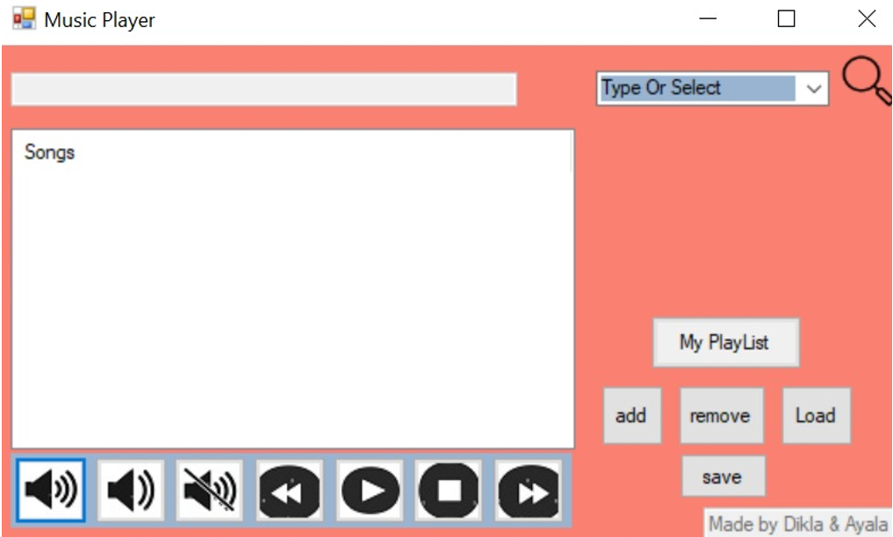
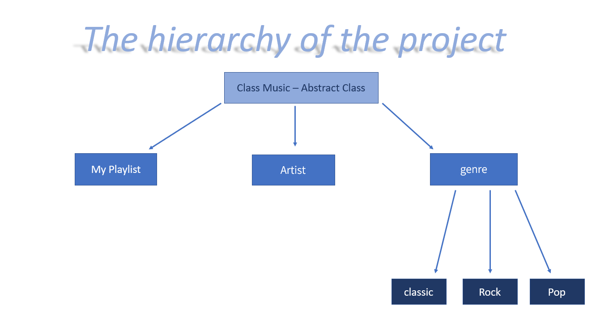

  <a href="https://github.com/AyalaTzabari">
     

 
<i>Music Player 🎵🎼 
<a href="https://code.visualstudio.com/docs/csharp/get-started">Using 
 </a>
</i>
  
  
## About the Project 🎶

Class Music is an abstract class that has the functions: Play, Stop, PlayNext , PlayPrevious, Display, Shaffle and CurrentSong.

We override those function in the Genre class- we adapted it to work for every genre. In addition we implement a virtual function that represent the instrument of the genre.
Pop, Rock and classic classes heiresses from genre class and uses his functions. 
What is the different between the genres?
1. The instrument 🎷🎸🎹🎺.
2. Every genre has a different queue of songs.

Artist class heir from music class – we override the functions to work to a specific artist that the account type.
Playlist class heir from music class - we override the functions of music and implement save, remove and load functions.

  
